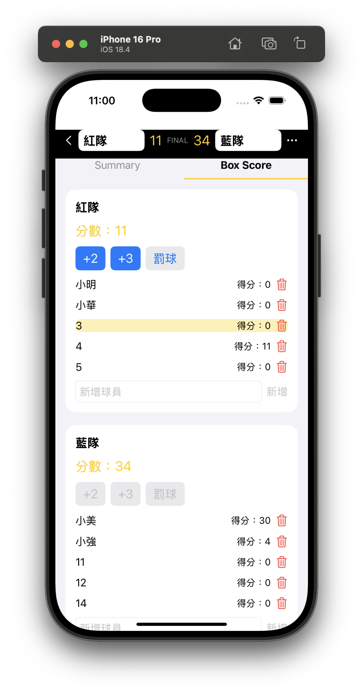
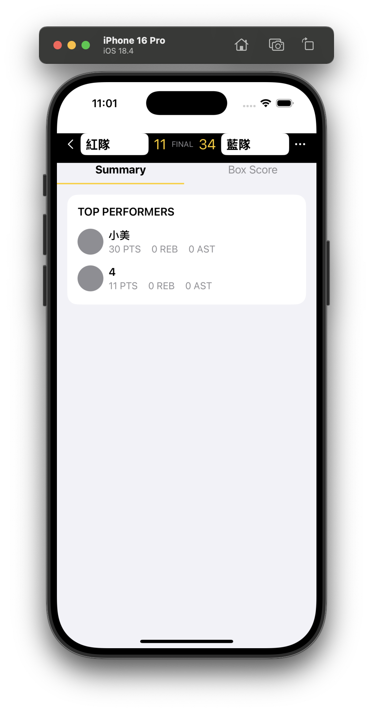
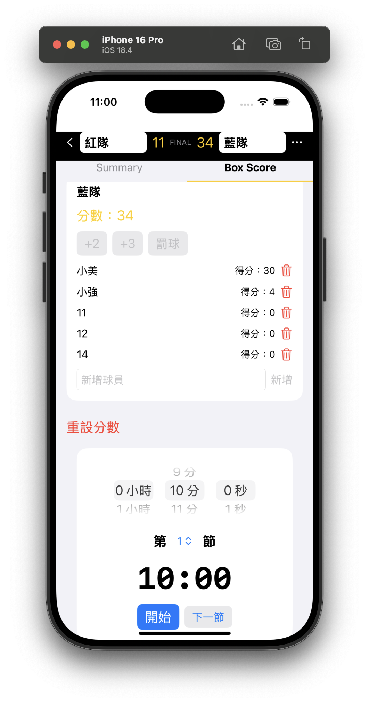

# 📊 BoxScore (scoreboard)

一個超 Chill 的 iOS 籃球計分板 App，適合各種球賽、桌遊、聚會用！SwiftUI 打造，介面簡單、操作直覺，讓你專注比賽不分心 🏀🏆

---

## 🖼️ App 截圖

> 
> 
> 
> 
> 
> 
> _（如需更換圖片，請將對應檔案放在專案根目錄即可）_

---

## 🚀 主要功能
- 支援紅隊/藍隊分數統計，適合籃球賽事
- 多人計分，支援自訂球員名稱
- 分數即時更新，UI 超直觀
- 支援深色模式（Dark Mode）
- 完全本地運算，無需網路
- 一鍵新增/刪除球員，操作超順手

---

## 🛠️ 安裝方式
1. 下載或 clone 此 repo：
   ```zsh
   git clone https://github.com/Ericthegoatskr/scoreboard.git
   ```
2. 用 Xcode 15+ 開啟 `boxscore/boxscore.xcodeproj`
3. 選擇模擬器或真機，直接 Build & Run！

---

## 💻 開發環境
- Xcode 15 以上
- Swift 5.9+
- 支援 iOS 16+

---

## 🤝 貢獻方式
1. Fork 本 repo
2. 建立新 branch (`feature/你的功能`)
3. 提交 PR，記得寫清楚改了什麼！

---

## 📄 License
MIT License

---

> Made with ❤️ by Eric 